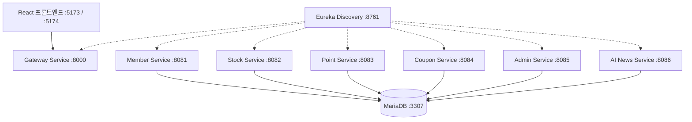

# 🏛️ Stock Game Mechanism (Spring Cloud MSA Backend - v1 Archive)

> ⚠️ **[Archive & Reference System Notice]**  
> 본 저장소는 Spring Cloud 기반 9개 마이크로서비스로 구축된 학급 모의투자 플랫폼의 **v1 레거시 백엔드 아카이브(기록 및 보존용)**입니다.  
> 원형 그대로 영구 보존되며, 차세대 BaaS 시스템은 **[`stockGame_supabase`](https://github.com/skfkfkvlrm/stockGame_supabase)**에서 전담합니다.

[](https://github.com/skfkfkvlrm/stockGame_mechanism)
[](https://spring.io/)
[](https://openjdk.org/)
[]()

---

## 📌 1. 마이크로서비스 아키텍처 및 포트 구성



| 서비스 모듈 | 디렉토리 | 포트 | 주요 역할 |
|:---|:---|:---:|:---|
| **`eureka-service`** | `eureka-service/` | `8761` | 서비스 디스커버리 및 레지스트리 |
| **`gateway-service`** | `gateway-service/` | `8000` | 단일 진입로 라우팅 및 CORS / JWT 검증 게이트웨이 |
| **`member-service`** | `member-service/` | `8081` | 학생/관리자 인증, 회원가입, JWT 발급 |
| **`stock-service`** | `stock-service/` | `8082` | 10호가 매칭 엔진, STOMP 웹소켓 브로드캐스트 |
| **`point-service`** | `point-service/` | `8083` | 학생 포인트 잔고 조회 및 입출금 원장 기록 |
| **`coupon-service`** | `coupon-service/` | `8084` | 쿠폰 상품 구매, 보유 쿠폰 관리, 일련번호 발급 |
| **`admin-service`** | `admin-service/` | `8085` | 학생 포인트 강제 조정, 종목 상장/수정, 시장 개폐 토글 |
| **`ai-news-service`** | `ai-news-service/` | `8086` | 로컬 Ollama 연동 가상 경제 뉴스 자동 생성 및 주가 변동 연계 |
| **데이터베이스** | Docker Container | `3307` | MariaDB `stockgame` 스키마 |

---

## 🚀 2. 주요 기능 (Key Features)

### ① 고성능 주식 매칭 엔진 (부분 체결 로직)
- 매수/매도 수량이 일치하지 않더라도 체결 가능한 수량만큼 즉시 체결되는 **Split(분할) 기반 부분 체결 시스템**
- 복수의 대기 주문을 순회하며 일괄 체결 처리 및 트랜잭션 무결성 보장

### ② 실시간 웹소켓 (STOMP) 연동
- `spring-boot-starter-websocket` 기반 양방향 통신
- **호가창 브로드캐스트 (`/topic/orders/{stockId}`)**: 주문 접수/체결 시 실시간 이벤트 브로드캐스트
- **개인별 알림 (`/queue/notifications`)**: 당사자 체결 알림 실시간 전송

### ③ 실시간 OHLCV 및 스케줄러 로직
- 거래 성사 시 `ON DUPLICATE KEY UPDATE`를 활용해 일일 **시가, 고가, 저가, 종가, 거래량** 실시간 갱신
- Spring Scheduler를 통한 자정 기준가(`prev_price`) 자동 동기화

### ④ 관리자 전용 Admin API
- 학생 포인트 지급/차감 및 포트폴리오 조회
- 신규 종목 상장, 발행가/잔량 수정, 상장폐지
- 시장 개장/휴장 원터치 토글 (음수 입력 방어 로직 적용)

---

## 🛠️ 3. 기술 스택

| 분류 | 기술 |
|---|---|
| **Language** | Java 21 |
| **Framework** | Spring Boot 3.5.x, Spring Cloud 2023.x |
| **Discovery & Gateway** | Netflix Eureka, Spring Cloud Gateway |
| **Database** | MariaDB 10.x (Port: 3307) |
| **ORM & Persistence** | Spring Data JPA + MyBatis 하이브리드 |
| **Security** | Spring Security, JJWT |
| **Messaging** | WebSocket (STOMP, SockJS) |
| **Inter-Service** | OpenFeign |

---

## ⚙️ 4. 실행 및 관리 (Run Daemon)

전체 9개 마이크로서비스 및 MariaDB를 일괄 구동하거나 중지하기 위한 전용 PowerShell 오케스트레이터가 제공됩니다:

```powershell
# 전체 마이크로서비스 백그라운드 일괄 시작
.\run_daemon.ps1 -Action start

# 전체 마이크로서비스 구동 상태 확인
.\run_daemon.ps1 -Action status

# 전체 마이크로서비스 일괄 정상 종료
.\run_daemon.ps1 -Action stop
```

---

## 🔗 5. 관련 레포지토리
- 🚀 차세대 백엔드 (v2 BaaS): [stockGame_supabase](https://github.com/skfkfkvlrm/stockGame_supabase)
- 👨‍🎓 학생 포털 프론트엔드: [stockGame_react](https://github.com/skfkfkvlrm/stockGame_react)
- 👩‍🏫 관리자 포털 프론트엔드: [stockGame-admin-react](https://github.com/skfkfkvlrm/stockGame-admin-react)
- 📚 마스터 기획서 및 감사 보고서: [skfkfkvlrm-json-lib](https://github.com/skfkfkvlrm/skfkfkvlrm-json-lib)